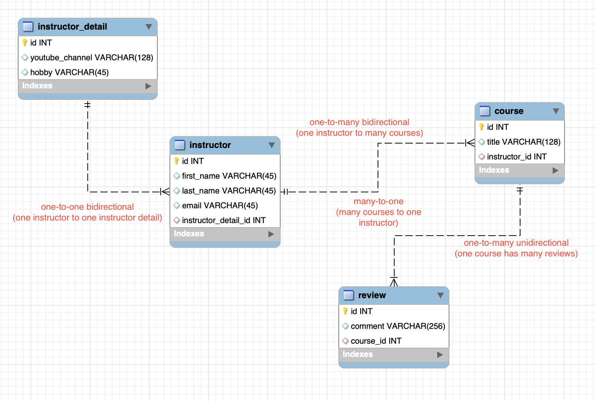

# 9_SpringBoot_One_To_Many
Explores one-to-many mappings in Spring Boot

Here's the database schema we'll be running CRUD operations on:

    

## A note on lazy vs eager loading
Lazy loading is preferred, but the caveat is you'll always need an active Hibernate session. 

If the Hibernate session is closed and you attempt to retrieve lazy data, Hibernate will throw an exception.

Note that the default loading method for one-to-many is LAZY. 